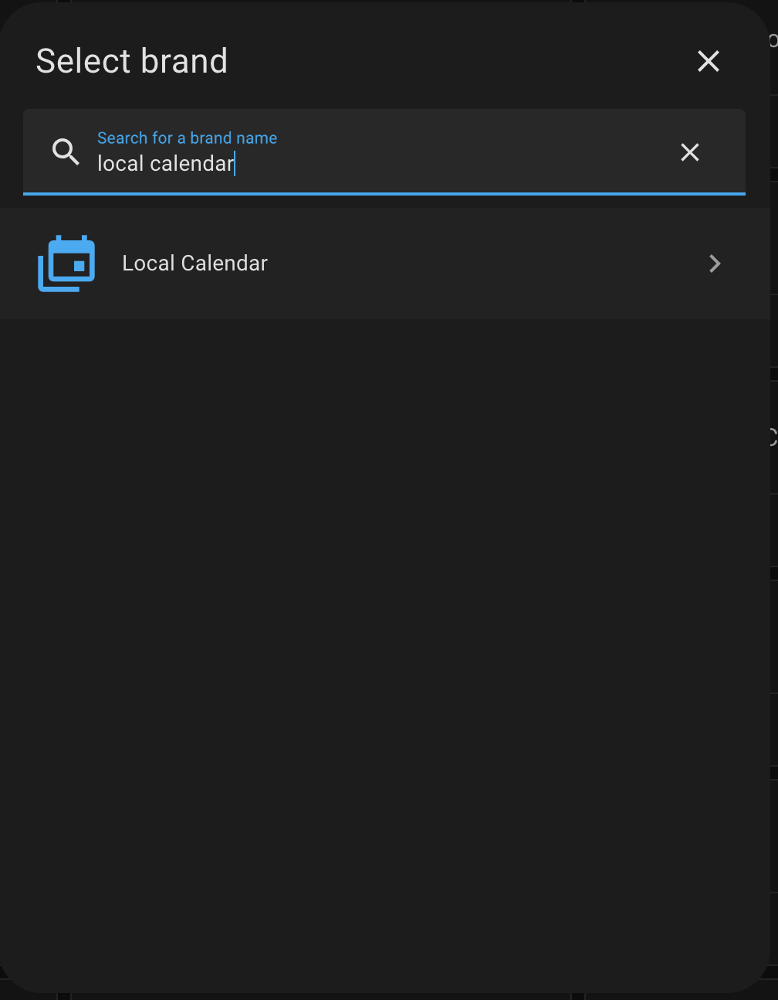
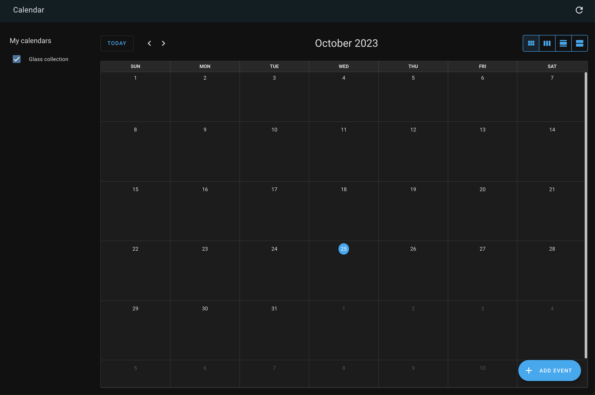
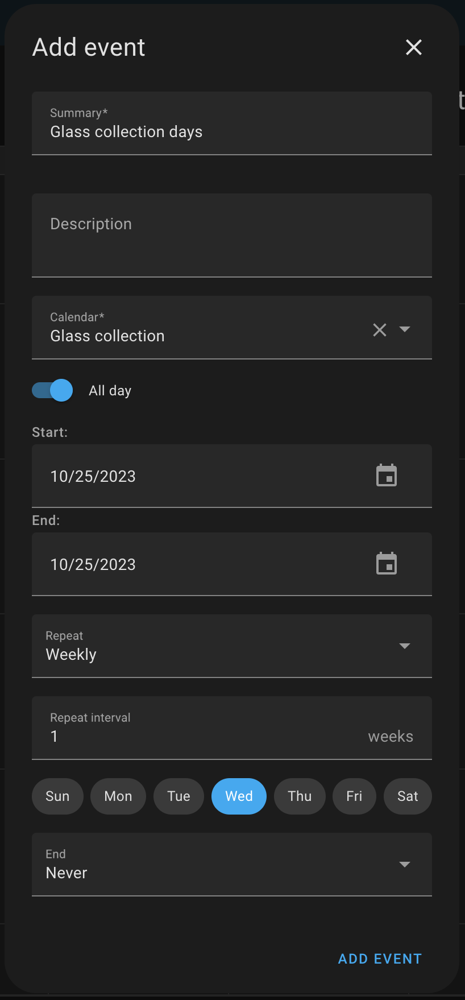
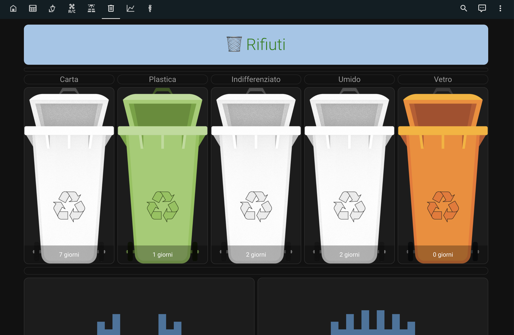

# Home Assistant garbage management schedule
A mini Home Assistant step-by-step tutorial on how to manage your household waste collection calendar using Home Assistant:

### Prerequisites:

* Make sure you have Home Assistant and HACS (Home Assistant Community Store) installed and configured.

+ Install the frontend components `config-template-card` and `button-card` via [HACS](https://hacs.xyz/).

### Creating the Calendar:

* Go to the "Settings" section in your Home Assistant dashboard.

* Under "Device and Services," select "Add Integration."

* Search and select "Local calendar" and add a new calendar, for example, "Glass Collection."




* Navigate to the "Calendar" section, and you will find the newly created calendar ("Glass Collection").



* In the calendar section you just created, click on the "Add Event" button to create an event for glass collection. Modify it as follows (for example): 



* Click "Add event" to confirm the addition of the event to the calendar.

### Editing the configuration.yaml for a new Template sensor

* Edit your `configuration.yaml` file and add a new template sensor as follow:

```
template:
  - sensor:
    - name: "glass_collection_schedule"
      state: >-
        {{ min(((state_attr('calendar.glass_collection','start_time') | as_timestamp - today_at('00:00') | as_timestamp) / 86400) | int, 2) }}
      attributes:
        days: >-
          {{ ((state_attr('calendar.glass_collection','start_time') | as_timestamp - today_at('00:00') | as_timestamp) / 86400) | int }}
```

### Lovelace interface configuration

* Download the `bidone_gray.png`, `bidone_orange.png`, and `bidone_green.png` files into the `/config/www/garbage_images` directory. Make sure these files are available in the specified directory. 

* Open a terminal on Home Assistant, then navigate to the `/config/www` directory:

```
cd /config/www
```

* Create a new directory called garbage_images using the following command:
  
```
mkdir garbage_images
```

* Enter the newly created directory:

```
cd garbage_images
```

* Download the files from their respective URLs using the wget command. For example:

```
wget 'https://github.com/bigmoby/ha_garbage_management/raw/main/bidone_gray.png' -O bidone_gray.png
wget 'https://github.com/bigmoby/ha_garbage_management/raw/main/bidone_orange.png' -O bidone_orange.png
wget 'https://github.com/bigmoby/ha_garbage_management/raw/main/bidone_green.png' -O bidone_green.png
```

* Restart Home Assistant

Now, you can configure the garbage bin images in the Lovelace interface by using these images from the `/local/garbage_images/` directory.

* Open a Dashboard in yaml edit mode and add this snippet into it:

```
type: vertical-stack
cards:
  - type: horizontal-stack
    cards:
      - type: vertical-stack
        cards:
          - type: 'custom:button-card'
            name: Carta
            template: label_center 
            styles:
              card:
                - padding-top: 0px 
                - padding-bottom: 0px 
          - type: custom:config-template-card
            entities: 
              - sensor.glass_collection_schedule
            variables: 
              DAYS: states['sensor.glass_collection_schedule'].attributes['days'] + ' days'
            card:
              type: picture-entity
              entity: sensor.glass_collection_schedule
              name: "${DAYS}"
              show_name: true
              show_state: false
              state_image:
                '0': /local/garbage_images/bidone.png
                '1': /local/garbage_images/bidone_green.png
                '2': /local/garbage_images/bidone_gray.png
```

Please, repeat from the calendar creation step for all garbage type you want.

...and something like this should appear:



Credits [@bruxy70](https://github.com/bruxy70). Thank you!